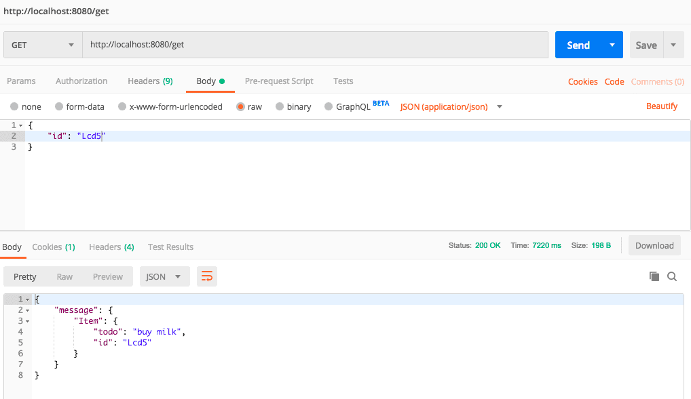
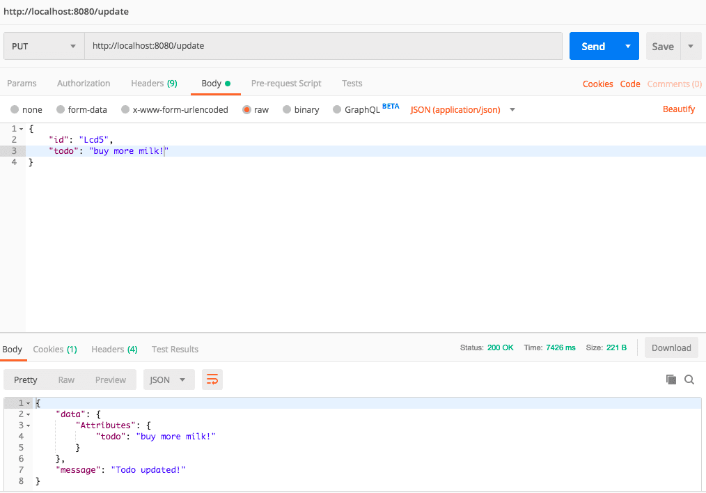

# Serverless To-Do Application

## Overview of App

The To-Do application is powered by AWS platform. The app uses the following technologies:
GitHub link: https://github.com/deepakHonakeri05/Serverless-ToDo-app-aws

1. AWS Lambda
2. API Gateway
3. Amazon DynamoDB

The technology stack includes React, Node.js, AWS SAM (Serverless Application Model) CLI and Docker.

The project makes use of SAM CLI tool to handle serverless resources used for the backend which are AWS Lambda, API-Gateway, and DynamoDB.

The requires Docker and SAM CLI to be installed locally.

Working of the proejct

The project makes use of SAM CLI tool to handle serverless resources used for the backend which are AWS Lambda, API-Gateway, and DynamoDB.

The requires Docker and SAM CLI to be installed locally.

## Purpose of the project

To get familiar with SAM CLI and docker to better utilize the AWS resources. And, to learn, setup and execute AWS resources locally on the machine.

## Screenshots
1. Get a To Do item

2. Update a To-Do item

3. Delete a To-Do item

